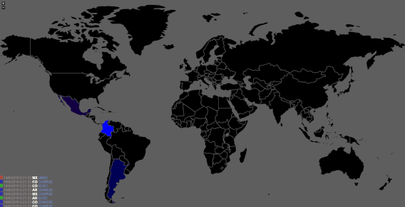

# lightning
Real time world event display

### Preview:

### How to run:

npm install

npm start

### How to send events:

POST Request to http://localhost:3000/event with params **countryCode**, **color** and **message**, example:

* countryCode: "US"
* color: "#00FF00"
* message: "Event description"

(x-www-form-urlencoded)

All clients will be notified via web sockets
